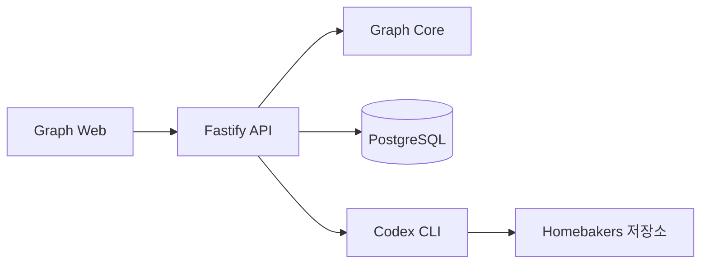

# Homebakers 그래프 엔지니어링 구조

## 패키지 경계

| 구성 | 위치 | 책임 |
| --- | --- | --- |
| Homebakers 앱 | `apps/homebakers` | 레시피·커뮤니티 화면과 브라우저 저장소 |
| 그래프 편집기 | `apps/graph-web` | 노드 편집, 검증, 저장, 역할 실행 상태 확인 |
| 그래프 API | `apps/api` | Fastify 라우트, 실행 조정, Codex CLI 연결 |
| 그래프 코어 | `packages/graph-core` | 문서 스키마, 노드 종류, 연결 규칙, 실행 순서 |
| 영속 저장소 | `db/migrations` | 그래프와 역할 실행 기록의 PostgreSQL 스키마 |
| 프로젝트 역할 정의 | `harness` | Homebakers의 그래프와 역할별 지시사항 |

`apps/homebakers`의 사용자 데이터는 기존처럼 브라우저 `localStorage`에 있습니다. 그래프 정의와 실행 기록은 `apps/api`를 통해 PostgreSQL에 저장합니다.

## 데이터와 실행 흐름

- 그래프 문서는 노드, 연결, 뷰포트와 버전 번호를 갖습니다. 저장 시 문서 형식·설정을 검사하고 revision 충돌을 감지합니다.
- 실행 시 시작·종료 노드 수, 연결성, 순환, 역할 노드를 검사하고 의존성 단계별로 실행합니다.
- Planner와 Researcher는 병렬이며, Builder는 두 결과를 받고 코드를 변경합니다. Reviewer는 Builder 결과를 읽기 전용으로 검토합니다.
- 각 실행의 그래프 문서와 역할별 상태·출력은 PostgreSQL에 기록됩니다.
- 공통 역할 권한은 `packages/graph-core/src/roles.ts`, Homebakers별 지시사항은 `harness/roles.json`에 있습니다.

## 개발 주소

| 서비스 | 주소 |
| --- | --- |
| Homebakers 앱 | `127.0.0.1:5173` |
| 그래프 편집기 | `127.0.0.1:5174` |
| Fastify API | `127.0.0.1:3002` |
| PostgreSQL | `127.0.0.1:5433` |

그래프 편집기는 `/api` 요청을 Fastify로 프록시합니다. API는 `.env`의 `CODEX_WORKSPACE=.`을 해석해 이 저장소 루트에서 역할을 실행합니다. `harness:sync`와 `harness:run`도 이 로컬 API를 사용합니다.
